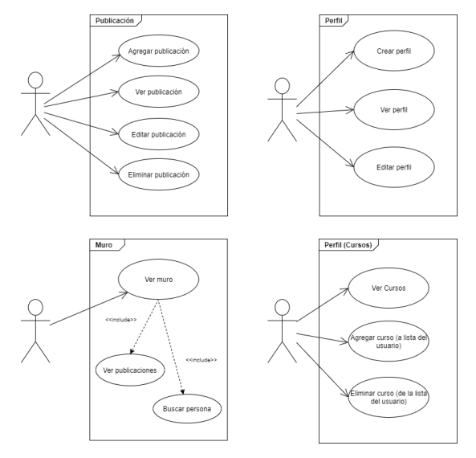
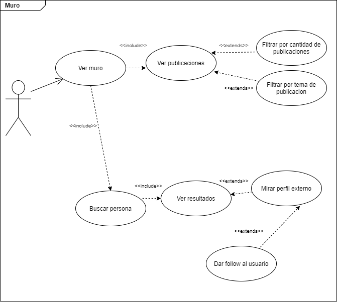
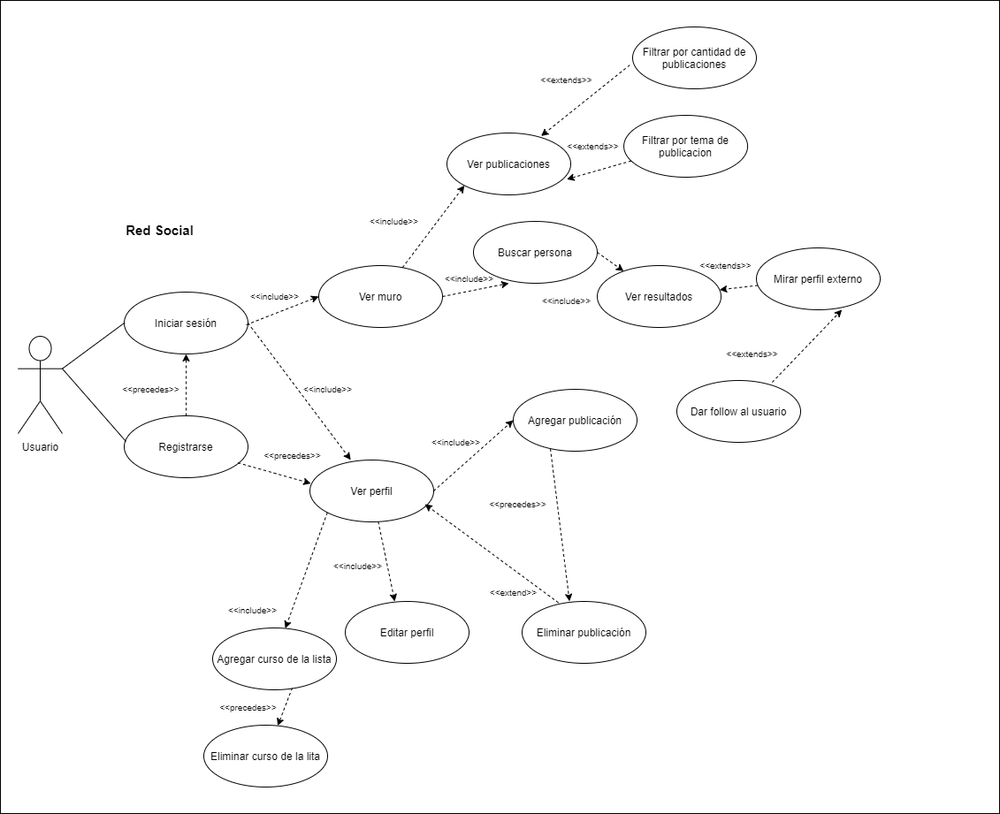

# Proyecto: BEDU SOCIAL
Proyecto Final de la Fase 2 Módulo 3 BEDU-Santander

## Equipo 1
 
### Integrantes del equipo
* Gabriela Aideé Castillo Del Valle 
* Marco Antonio Galíndez Cortés 
* Karina Lizeth Ortiz Muñoz
* Lourdes Araceli García Eulogio 
* Juliet Guadalupe Quintero Rocha
 
# Definición general del proyecto #
## Descripción
Nuestro proyecto consiste en desarrollar un sistema con la temática de una red social para la comunidad de Bedu. Nuestro propósito es crear una red social con las funcionalidades propias de un sistema como este, cumpliendo con las especificaciones del proyecto al implementar los temas que vemos en clase y complementando con nuestra investigación para lograr el mejor resultado.  

“Las redes sociales son comunidades formadas por diferentes usuarios y organizaciones que se relacionan entre sí en plataformas de Internet.” Rosario Peiró (03 de octubre, 2017).
Con esto en mente al momento de crear nuestro proyecto hemos establecido que las funcionalidades sean características que permitan cumplir con la finalidad de estas plataformas y que a la vez nos permitan implementar una API pues van de la mano en la manera que se necesita la información para su correcto funcionamiento.

El proyecto toma la temática central de la comunidad Bedu. Se permite la creación de cuenta para nuevos usuarios, ingresar información que detalla su perfil como Username, Nombre, perfil de Github, descripción,  cursos tomados. Una vez que tiene su cuenta, el usuario tiene permitido actualizar su contraseña. Se contempla la existencia de un muro en el que se mira la actividad, es decir, se pueden mirar las publicaciones existentes, y se pueden filtrar por tema, el usuario podrá crear, editar y eliminar sus propias publicaciones. Además se permite la búsqueda de personas, lo cual lleva a desplegar los resultados para permitir seleccionar y acceder al perfil de las personas; cuando nos encontramos en el perfil de alguien podemos ver su información, incluidos los cursos que ha tomado y tenemos la opción de seguir anónimamente a dicho usuario. Cabe mencionar que algunos campos están disponibles para elegir con base en las opciones que se han predefinido siendo el caso, por ejemplo, el tipo de usuario, la lista de cursos, los temas de las publicaciones, el avatar del perfil.


## Estructura del proyecto
### Descripción de entidades
 Las entidades que interactúan en nuestro proyecto son :

Usuarios, Cursos, Publicaciones

Contemplamos que las entidades tienen los siguientes atributos : 

* Usuarios : Id, Username, Name, LastName, Email, Password, GithubUser, Type { }, Avatar { }, Cursos { }, Followers
* Cursos: Id, Code, Name
* Publicaciones : Id, Title, Description, Topic, Author

#### Interacciones
Con las entidades anteriores, se conformará el perfil del usuario, que si bien no es una entidad concreta, sí es el resultado de toda la interacción dentro del sistema y una característica esencial de las redes sociales.

Observando el flujo del sistema podemos ver la interacción entre:

* Usuarios(Entidad) - Perfiles(Resultado) : Los perfiles obtienen la información con base en sus usuarios (es dependiente de)

* Cursos - Usuarios : Los usuarios son quienes mencionan qué cursos han tomado

* Usuarios - Publicaciones : Los usuarios tienen la capacidad crear, ver, modificar y eliminar publicaciones.

* Publicaciones - Perfiles : Los perfiles tienen publicaciones 

* Usuarios - Usuarios : Los usuarios pueden dar follow anónimo a otros usuarios y enterarse dentro de su perfil de la información que hayan registrado, como los cursos y su cuenta de Github.

### Servicios
* Usuario: Get, Post, Put ( para el campo Password y algunos datos concretos)

* Cursos  : Get (Estarán predefinidos, por lo que no se podrán agregar, editar ni eliminar)

* Publicaciones : Get , Post, Delete, Put


### Historias de usuario
 1. Como nuevo usuario quiero registrarme en la red social para tener un perfil y acceder 
 2. Como usuario existente quiero acceder a la red social
 3. Como usuario quiero elegir un avatar (dentro de los que se muestran disponibles en la red social) en mi perfil
 4. Como usuario quiero agregar una descripción en mi perfil
 5. Como usuario quiero agregar cursos (de la lista disponible) que he tomado
 6. Como usuario quiero actualizar cursos que he tomado
 7. Como usuario quiero acceder para mirar el muro con las publicaciones realizadas por los demás usuarios
 8. Como usuario quiero acceder al muro para agregar una publicación 
 9. Como usuario quiero acceder al muro para buscar personas
 10. Como usuario quiero hacer click al resultado de búsqueda de persona para mirar su perfil
 11. Como usuario quiero dar follow (anónimo) a una persona dentro de su perfil
 12. Como usuario quiero acceder a mi perfil para editar los campos permitidos
 13. Como usuario quiero eliminar mi publicacion
 14. Como usuario quiero acceder al muro para filtrar publicaciones por cantidad seleccionada
 15. Como usuario quiero acceder al muro para filtrar por tema de publicación

### Casos de uso
* Perfil
  - Registrarse (creación de perfil)
  - Modificar perfil
  - Ver perfil (propio o de otro usuario)
  
* Publicación
  - Crear publicación
  - Ver publicación (propia o de otro usuario)
  - Eliminar publicación (propia)
  
* Curso
  - Ver curso
  - Agregar curso (a la lista de cursos tomados)
  - Eliminar curso (de la lista de cursos tomados)
 

* Buscar persona
* Mirar perfil externo
* Dar follow (anónimo)
* Ver muro (todas las publicaciones)
* En el muro : Filtrar por tema de publicación
* En el muro : Filtrar publicaciones por cantidad








[Diagramas de casos de uso](https://app.diagrams.net/#G1Q9Vrauep4LrImQzg6h1PACLoq0dmqOqh)
  
  
## Herramientas empleadas
La API está desarrollada en **Node.js**. 
El ODM a utilzar es **Mongoose**.

En el proyecto utilizaremos las siguientes dependencias:
**Express** para realizar el ruteo de la aplicación.
**body-parser** para facilitar a Express leer el cuerpo de la petición.
**crypto** para el cifrado de las contraseñas utilizando un hash.
**express-jwt** para el uso del estándar de creación de tokens JWT.
**mongoose** para la conexión con la base de datos que estará en **MongoDB**.
**mongoose-unique-validator** para validad que los campos marcados como únicos, en el modelo de la entidad, no se repitan en la base de datos.
**passport** para la autenticación.
Durante el desarrollo se utilizó **Nodemon**, ya que actualiza automáticamente el servidor a medida que vamos realizando cambios.

## Enlace a la API en Heroku
[Bedu Social](https://bedusocial.herokuapp.com/v1)

## Swagger
[Documentación de la API](https://app.swaggerhub.com/apis-docs/none5234/BeduSocial/1.0.0)

## Postman Collection
[Consultas](https://documenter.getpostman.com/view/6751780/UUxxhoQs#intro)

## Prototipos de interfaz de usuario
[Prototipos](https://github.com/Lulucornio/proyecto-modulo3/blob/master/images/Bedu%20(1).pdf)


## Estructura de las carpetas del proyecto

```bash

proyecto-modulo3/
├── config/
├── controllers/
│   ├── courses.js
│   ├── posts.js
│   └── users.js
│
├── models/
│   ├── Course.js
│   ├── Post.js
│   └── User.js
│
├── routes/
│   ├── courses.js
│   ├── index.js
│   ├── posts.js
│   └── users.js
│
├── app.js
├── package-lock.json
├── package.json
├── .gitignore
└── README.md

```


## Instalación de dependencias

Para la instalación de las principales dependencias se deberá ejecutar el siguiente comando en la carpeta raíz del proyecto
```
npm i
```
Para utilizar nodemon, este se deberá instalar de forma global (nodemon solo se utiliza durante la fase de desarrollo)

```
npm install -g nodemon
```
Ejecutar el proyecto en modo desarrollo
```
npm run dev
```
